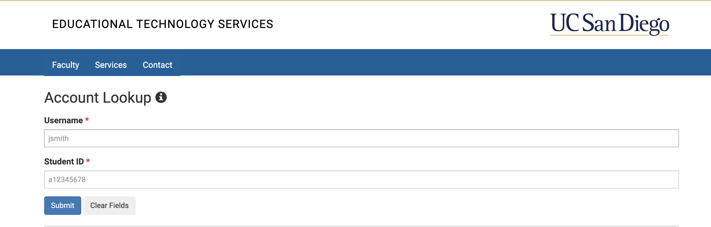
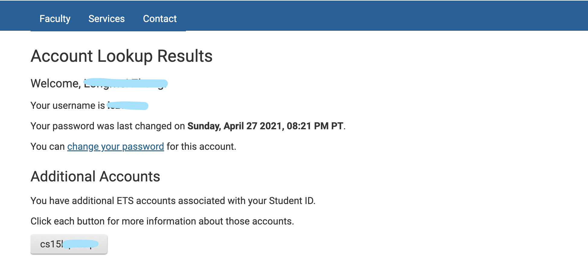
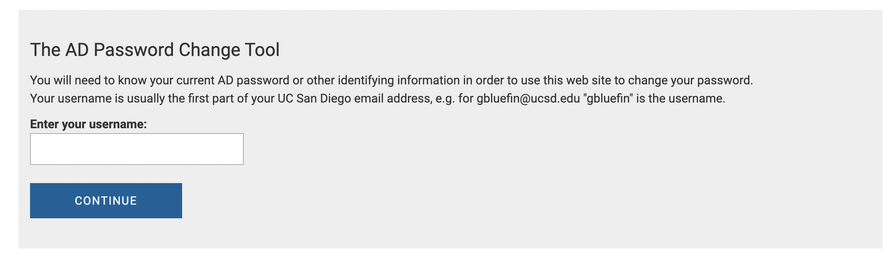

# Get Your CSE15L Account

1. look up your cse15L account from this link: [Link](https://sdacs.ucsd.edu/~icc/index.php). Then insert your UCSD username and PID

2. The code in the grey box that starts with "cse15'" is the username of your course specific account. Click on the blue text "change your password" to set the password for your account. 

3. enter your course specific account into the blank box. Then follow instructions to set up your password. 

4. Once you see a page that says "AD Password Change for User (*your course specific username*)", you are done setting up your account! Congratulation!
