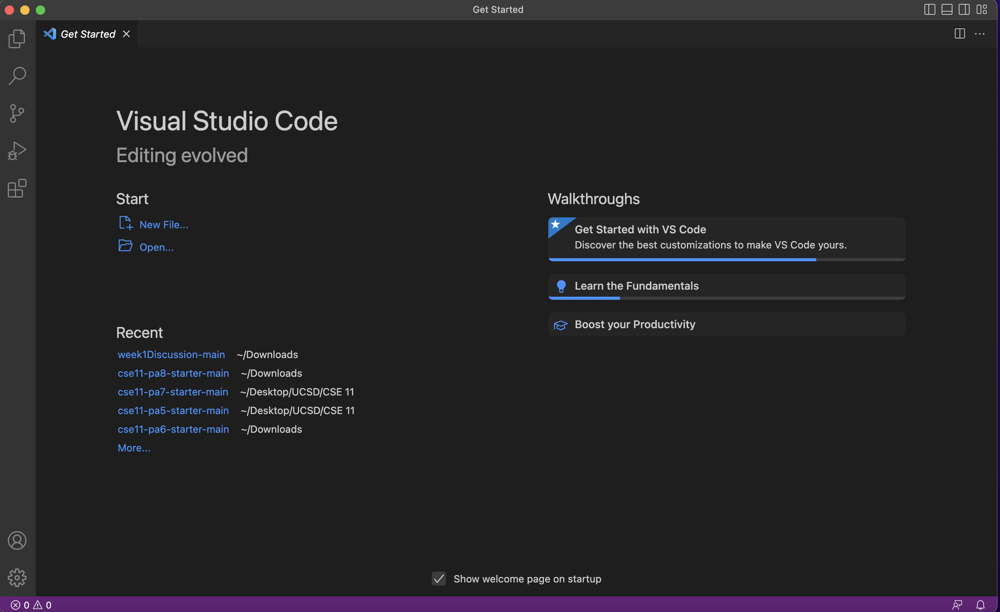
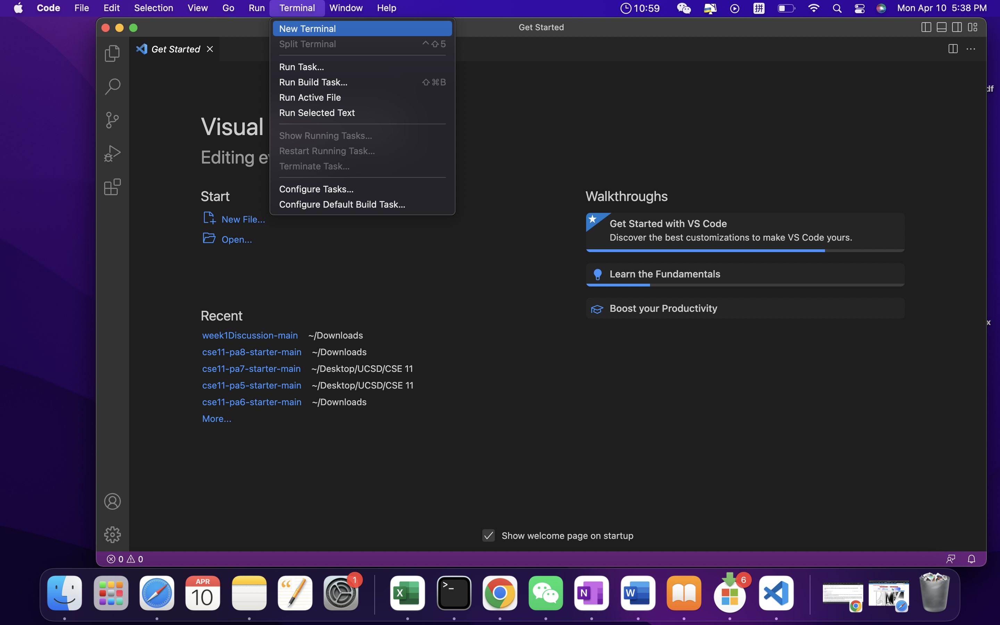
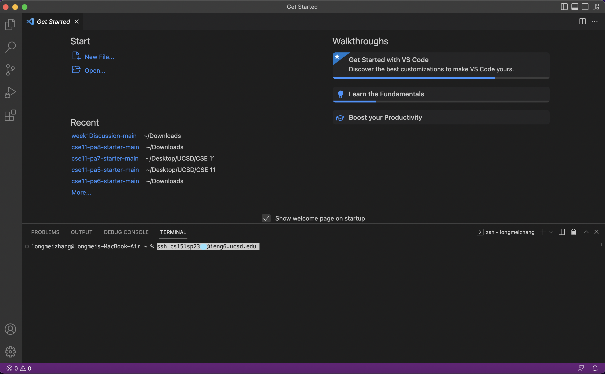
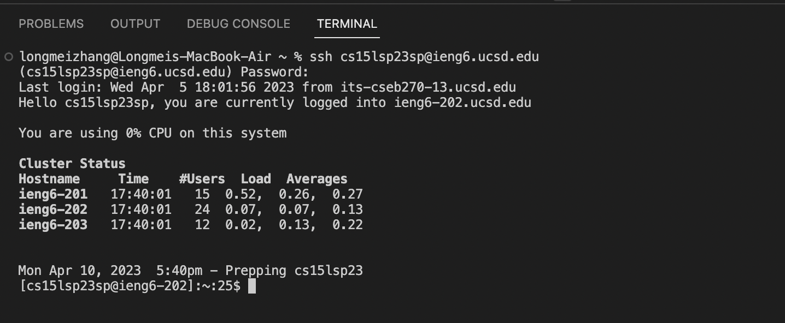
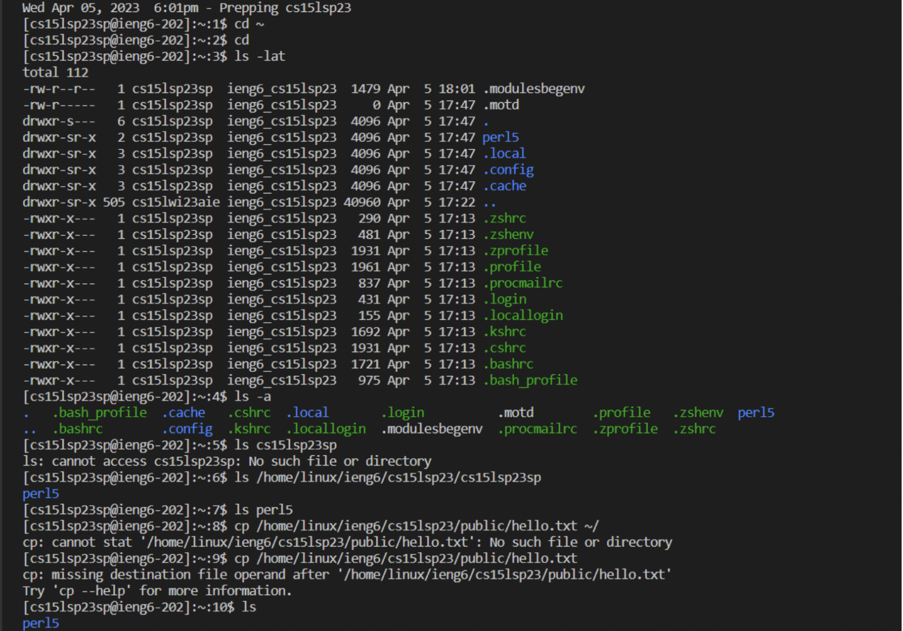

# First Step: Get Your CSE15L Account

1. look up your cse15L account from this link: [Link](https://sdacs.ucsd.edu/~icc/index.php). Then insert your UCSD username and PID

2. The code in the grey box that starts with "cse15'" is the username of your course specific account. Click on the blue text "change your password" to set the password for your account. 

3. enter your course specific account into the blank box. Then follow instructions to set up your password. 

4. Once you see a page that says "AD Password Change for User (*your course specific username*)", you are done setting up your account! Congratulation!

# Second Step: Install Visual Studio Code

1. You might have VScode installed already for previous CS courses. If you haven't, click on the Visual Studio Code website here: [Link](https://code.visualstudio.com/) and follow the instructions to download VScode. 
2. After VScode is installed, try to open it. If you see a window like this, you have correctly installed VScode. 

# Third Step: Use VScode to Connect to a Remote Computer

1. Open a terminal in VScode

2. type "ssh cs15lsp23xx@ieng6.ucsd.edu" in the terminal, replace xx with the letters in your course specific username. Then insert your password. If this is your first time connecting to remote server, you might get a message asking you "...Are you sure you want to continue connecting (yes/no/[fingerprint])?". Type yes and then insert your password as instructed. 

3. If you see a message like the one in the image below, your terminal has remotely connected to a computer in the CSE basement. Good job!

# Fourth Step: Try Some Commands!

1. Try running commands like ls, cd, pwd, cp, and mkdir in different ways and observe the output. Try commands on both your computer and the remote server after connection. Below is examples of 10 different commands and their outputs in terminal. 

 2. after you are done, you can log out of the remote server with the command "exit".
